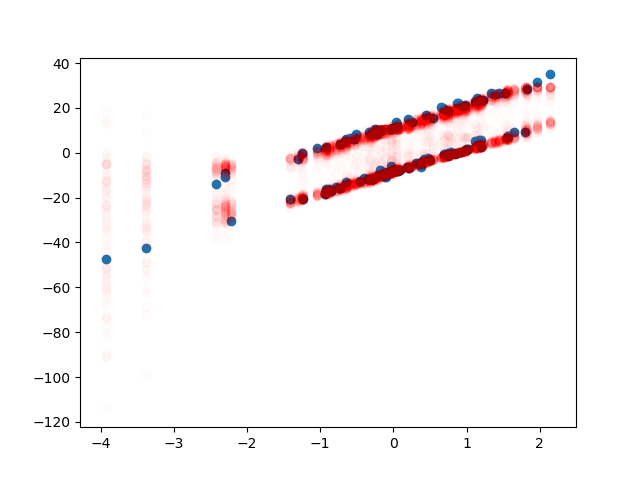
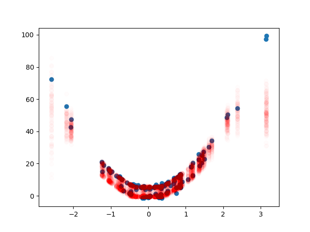
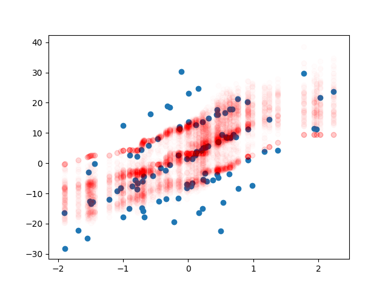

# Arbitrary distribution
Generating 100 samples from a neural network, creating a gaussian 
mixture.

Initially an additional loss function was considered, in order
to force the noise into the network. However, it is of course not
needed in this application since a KDE is created. In the case of
regularization using this method it is required.

## Linear bimodal
Simple linear bimodal test case to get started.

## Quadratic bimodal
Required some changes to hyperparameters in order to converge
to something reasonable.

## Linear multimodal
Also sensitive to hyperparameters. This approach would require
a hyperparameter search for more difficult distributions (this 
is standard anyway but sensitivity might be greater than normal).

A proper hyperparameter search would likely yield better results.
